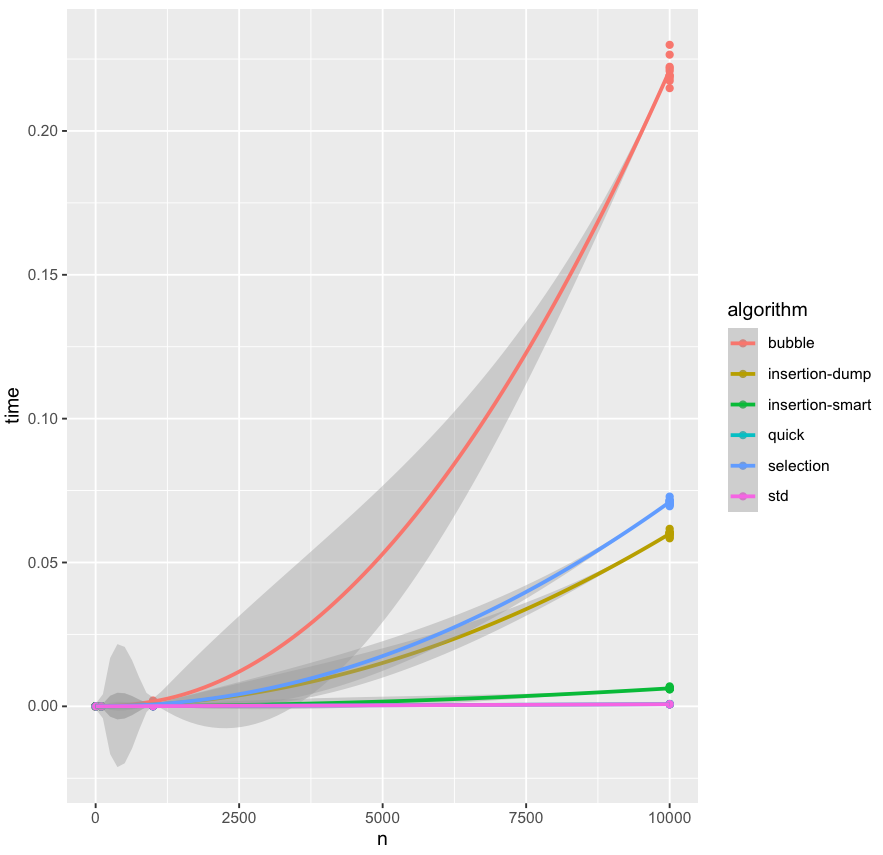

pangua
--
> -pangua verb
>       disarrange, disorder

Rust sorting algorithms based on [Crust of Rust: sorting algorithms](https://www.youtube.com/watch?v=K7v4EysI0kg)

Algorithms implemented:
* Bubble Sort
* Insertion Sort
* Selection Sort
* Quick Sort
* Heap Sort
* Merge Sort


## Generating Data

> cargo run --release > dat.values

## Plotting using R

```R
> t <- read.table('values.dat', header=TRUE)
> library(ggplot2)
> ggplot(t, aes(n, time, colour = algorithm)) + geom_point() + geom_smooth()
```



